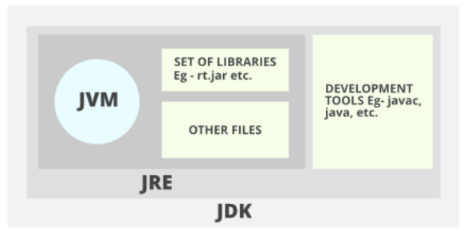

# JAVA NOTES:

### What is Java and Why do we use it:
    Java is a Class Based, Object Oriented Language. One reason that it
    may be used is because Java codes are very easy to maintain because
    Java does not allow many things that may lead to bad/inefficent
    programming if used incorrectly such as pointers so bad memory access
    is not possible in Java.

### JDK/JRE/JVM
    JDK (Java Development Kit): is a Kit that provides the environment to develop
    and execute the Java program Includes Development Tools and a JRE.
    JRE (Java Runtime Environment): An installation package that provides an
    enviromnet to run the java program onto your machine.
    JVM (Java Virtual Machine): Also known as the interpreter it is what's responsible
    for executing the java program line by line.

### Classes vs Objects:
### Methods and Parameters:
### Class Members
### Constructors:
### Packages and Imports:
### Primitive Types
### Wrapper Classes:
### Printing to Console:
### Literal Values (Maybe):
### Constant Primitive Values:
### Operators:
    +, - , /, these are all different operators. They are simply used to 
### Control Flow Statements:
### Compilation Process:
### Member Visibility and Access:
### Access Modifiers:
### Non-access Modifying Keywords (Abstract):
### Object Instantiation:
### Variable Scope (Local, Global):
### String API:
### StringBuilder and StringBuffer:
### Data Structure Basics:
### Arrays:
### Algorithm Basics:
### The Object Class:
### Errors vs Exceptions:
### 